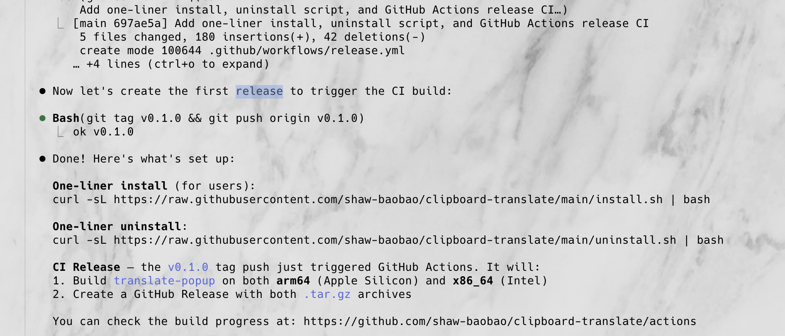

# clipboard-translate

[English](README.md) | [中文](README_CN.md)

选中一个单词，按 `⌘C`，鼠标旁边会弹出一个浮动窗口显示中文翻译。无按钮、不抢焦点、3 秒后自动消失。

适用于所有 macOS 应用，包括 Warp 等 GPU 渲染的终端。

## 演示



1. 双击选中一个单词
2. 按 `⌘C`
3. 鼠标旁边出现一个深色弹窗，显示翻译结果
4. 3 秒后自动消失

## 一键安装

```bash
curl -sL https://raw.githubusercontent.com/shaw-baobao/clipboard-translate/main/install.sh | bash
```

自动下载预编译二进制文件、安装依赖、设置开机自启。

## 手动安装

```bash
brew install translate-shell
git clone https://github.com/shaw-baobao/clipboard-translate.git
cd clipboard-translate
make install
make start
```

## 卸载

```bash
curl -sL https://raw.githubusercontent.com/shaw-baobao/clipboard-translate/main/uninstall.sh | bash
```

## 工作原理

两个组件：

1. **clipboard-translate.sh** — 一个 bash 循环，每 0.5 秒检查剪贴板。当检测到新的短文本（来自 `⌘C`），调用 `translate-shell` 获取中文翻译。

2. **translate-popup**（Swift）— 一个原生 macOS `NSPanel`，使用 `nonactivatingPanel` 样式，悬浮在所有窗口之上且不抢焦点。显示单词 + 翻译，3 秒后自动关闭。

## 许可证

Apache 2.0
